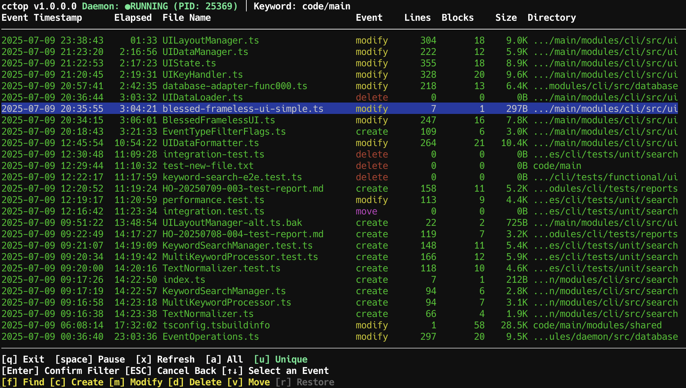

<div align="center">
    <h1>cctop</h1>
</div>

<div align="center">
    
</div>

Track file changes in real-time,
Monitor what AI agents are up to in your code!

## Installation and Usage

### Quick Start

```bash
npm install -g cctop
cctop # Start monitoring current directory
```

### Full Commands

```bash
# Start monitoring with real-time viewer. Daemon stops when you quit.
cctop

# Configuration
# Initialize .cctop directory with editable config files
cctop init
# Edit watchPaths in .cctop/config/daemon-config.json to customize tracking directories

# Background Tracking
# Keep monitoring on target directories even without viewer
cctop daemon start
cctop daemon status
cctop daemon stop

# Database Viewer
# Browse stored events - updates live if daemon is running
cctop view
```

## Features

### Overview

- **Real-time Monitoring** - Track file changes as they happen
- **Daemon Architecture** - Keeps tracking even when you're not watching
- **SQLite Storage** - Query your file change history
- **Interactive TUI** - Keyboard-driven interface
- **Smart Filtering** - Focus on what matters
- **Event Statistics** - File sizes, line counts, and more

### Keyboard Shortcuts

- `q` - Exit
- `space` - Pause/Resume event stream (auto refreshing tracking)
- `a`/`u` - Show all events / Show latest event per file
- `Enter` - Apply event-type / keyword filters
- `ESC` - Cancel current filter / Clear all filters

### Event Filtering

Filter events by type (`f`, `c`, `m`, `d`, `v`, `r`) or search by keyword (`/`).
See [detailed filtering guide](docs/event-filtering.md) for more information.

## Current Scope

- **Git Operations**: Currently doesn't track some operations, such as git stash or merge, and so on - only file system changes
- **Keyword Filtering**: Simple text matching only - regular expressions not yet supported
- **Supplementary Tool**: Designed as a monitoring assistant, not a replacement for git history or version control

## License

[MIT](LICENSE) © [@grad13](https://github.com/grad13)

---

Special thanks to [@lydell](https://github.com/lydell) for kindly transferring the npm package name.
