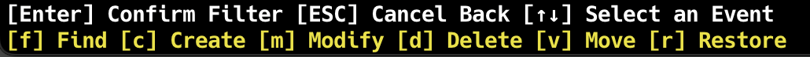

# Event Filtering Guide

cctop provides two ways to filter events: by event type and by keyword search.

## Event Type Filtering

Filter events by type using these keyboard shortcuts:

| Key | Event Type | Description |
|-----|------------|-------------|
| `f` | Find | Initial discovery of existing files when monitoring starts |
| `c` | Create | New files created |
| `m` | Modify | Files modified |
| `d` | Delete | Files deleted |
| `v` | Move | Files moved to a different location |
| `r` | Restore | Files restored |

### How to Use

1. Press any combination of the above keys to show only selected event types
2. For example, press `c` and `m` to see only Create and Modify events
3. The active filters are displayed in the filter status bar

### Screenshot

    

## Keyword Filtering

Search for specific files or paths using keyword filtering.

### How to Use

1. Press `/` to enter keyword search mode
2. Type your search term
3. Press `Enter` to apply the filter
4. Press `ESC` to cancel

### Current Limitations

- Simple text matching only - regular expressions are not yet supported
- Case-sensitive search
- Searches in file paths only

### Screenshot

    

## Combining Filters

You can use both event type filtering and keyword filtering together. For example:
- Filter by "Create" and "Modify" events
- Then search for files containing "test" in their path

## Clearing Filters

- To clear event type filters: Press the same keys again to toggle them off
- To clear keyword filter: Press `/` and then `Enter` with an empty search