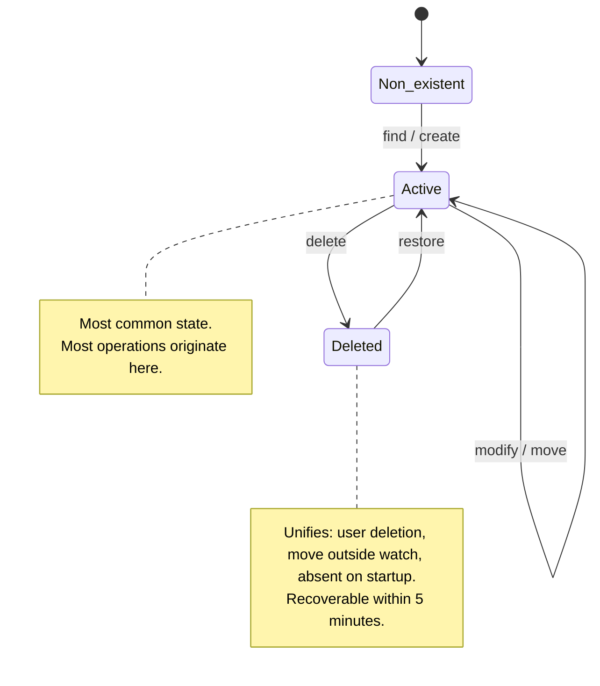

# Specification: File Lifecycle State

## 0. Meta

| Source | Runtime |
|--------|---------|
| daemon/src/events/FileEventHandler.ts | Node.js |

| Field | Value |
|-------|-------|
| Related | event-processor-implementation.md, database-schema-implementation.md |
| Test Type | Unit |

## 1. Overview

Complete state transition model for tracked files. Defines all states, events, and transition rules for the file lifecycle from initial discovery through deletion and restoration.

Related function: FUNC-001 (file lifecycle tracking).

## 2. State Transition Diagram

```mermaid
graph LR
    %% States (rectangles)
    START[Non-existent]
    ACTIVE[Active]
    DELETED[Deleted]

    %% Events (diamonds)
    FIND{find}
    CREATE{create}
    MODIFY{modify}
    MOVE{move}
    DELETE{delete}
    RESTORE{restore}

    %% Transitions
    START -->|initial scan| FIND
    START -->|new creation| CREATE

    FIND --> ACTIVE
    CREATE --> ACTIVE

    ACTIVE -->|content change| MODIFY
    MODIFY --> ACTIVE

    ACTIVE -->|move/rename| MOVE
    MOVE --> ACTIVE

    ACTIVE -->|file deleted / moved outside watch / absent on startup| DELETE
    DELETE --> DELETED

    DELETED -->|recreated at same path (within 5 min)| RESTORE
    RESTORE --> ACTIVE

    %% Styles
    classDef state fill:#e3f2fd,stroke:#2196f3,stroke-width:3px
    classDef stateDeleted fill:#ffebee,stroke:#f44336,stroke-width:3px
    classDef event fill:#fff3e0,stroke:#ff9800,stroke-width:2px,stroke-dasharray: 5 5

    class START,ACTIVE state
    class DELETED stateDeleted
    class FIND,CREATE,MODIFY,MOVE,DELETE,RESTORE event
```

## 3. Event Detection Branch Logic

```mermaid
graph TD
    START[chokidar: add] --> READY{ready state?}

    READY -->|before ready| FIND[find event]

    READY -->|after ready| ADD_CHECK{check history}
    ADD_CHECK -->|deleted state, within 5 min| RESTORE[restore event]
    ADD_CHECK -->|no history| CREATE[create event]

    CHANGE[chokidar: change] --> MODIFY[modify event]

    UNLINK[chokidar: unlink] --> WAIT{100ms wait}
    WAIT -->|add detected, same inode| MOVE[move event]
    WAIT -->|timeout| DELETE[delete event]

    STARTUP[startup scan] --> DB_CHECK{check DB active}
    DB_CHECK -->|not in FS| DELETE2[delete event (startup_missing)]

    style FIND fill:#e3f2fd
    style CREATE fill:#e3f2fd
    style MODIFY fill:#fff3e0
    style MOVE fill:#fff3e0
    style DELETE fill:#ffebee
    style DELETE2 fill:#ffebee
    style RESTORE fill:#f3e5f5
```

## 4. Simplified State Diagram



## 5. States

| State | Description | Characteristics |
|-------|-------------|-----------------|
| **Non-existent** | File does not exist; initial state before any tracking | Not registered in system |
| **Active** | Monitored and active | Most common state |
| **Deleted** | Deleted, moved outside watch scope, or absent on startup | Recoverable within 5 minutes |

## 6. Events

| Event | Description | Transition |
|-------|-------------|------------|
| **find** | Existing file discovered during initial scan | Non-existent → Active |
| **create** | New file created at runtime | Non-existent → Active |
| **modify** | File content or metadata changed | Active → Active |
| **move** | File moved or renamed | Active → Active |
| **delete** | File deleted, moved outside watch, or absent on startup | Active → Deleted |
| **restore** | File recovered from Deleted state (within 5 min) | Deleted → Active |

## 7. Complex Scenarios

### Scenario 1: Normal development flow
```
Non-existent → [create] → Active → [modify] → Active → [modify] → Active → [delete] → Deleted
```

### Scenario 2: Delete and immediate restore
```
Active → [delete] → Deleted → [restore (within 5 min)] → Active → [modify] → Active
```

### Scenario 3: System restart and recovery
```
Active → [system restart] → Deleted (startup_missing) → [restore] → Active → [modify] → Active
```

### Scenario 4: Move then delete
```
Active → [move] → Active → [delete] → Deleted → [restore] → Active → [move] → Active
```

## 8. Implementation Constraints

1. **State persistence**: File state is stored in `files.is_deleted` (boolean). All transitions are recorded in the `events` table.
2. **Restore time limit**: The Deleted → Restore transition is only valid within 5 minutes (configurable).
3. **Identity continuity**: `object_id` is preserved across all state transitions.
4. **Deleted state retention**: Deleted state rows are retained as history; no automatic purge.
5. **Unified delete semantics**: User deletion, move outside watch scope, and startup absence are all represented as `delete` events.
6. **Performance**: Active-state files constitute the vast majority; Active-state processing must be optimized.
7. **inode reuse**: inode values can be reused by the OS after deletion; identity must not rely on inode alone.
