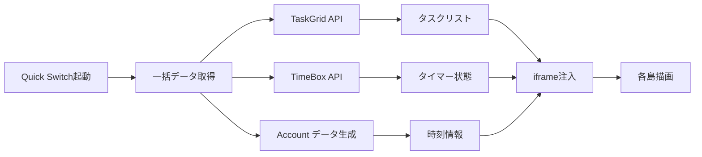

---
**アーカイブ情報**
- アーカイブ日: 2025-06-18（実行日）
- アーカイブ週: 2025/0616-0622
- 元パス: documents/records/reports/
- 検索キーワード: データ注入, 同期システム, Quick Switch, 軽量化, API通信, システム設計, 最適化, 重量化解決

---

# データ注入型同期システム設計

**作成日時**: 2025年06月12日 18:45
**設計者**: Claude Code Assistant  
**目的**: Quick Switch重量化問題の根本解決

## 🎯 問題分析と設計思想

### 現状の問題
- **高い通信コスト**: 各iframeが個別にAPI通信（3回×複数島）
- **重複処理**: 同じデータを複数回取得
- **ネットワーク負荷**: 60秒間隔の定期通信
- **表示遅延**: iframe個別読み込みによる待機時間

### 新設計の核心アイデア
**「必要な情報は実は非常に限られている」**

各島で本当に動的に必要な情報を分析：
1. **Account管理**: 時刻のみ（iframe独立処理で十分）
2. **TimeBox**: 各タスクの残り時間（一度取得後はJavaScript内で進行）
3. **TaskGrid**: タスクリスト（オーバービュー中は変更されない）

## 🏗️ データ注入型同期アーキテクチャ

### コア原理
```
従来: Quick Switch → iframe1, iframe2, iframe3 → 各自API通信
改善: Quick Switch → 一括API通信 → データ注入 → iframe表示
```

### データフロー設計


## 📊 各島別の同期戦略

### [1] Account管理島
**同期対象**: 現在時刻のみ
**戦略**: iframe内部でsetInterval処理（注入不要）
**理由**: 時刻は環境依存で共有する必要がない

```javascript
// Account側実装（現状維持）
setInterval(() => {
  updateCurrentTime();
}, 1000);
```

### [2] TimeBox島  
**同期対象**: 各タスクの残り時間とタイマー状態
**戦略**: 初期データ注入 + JavaScript内時間進行

```javascript
// 注入データ構造
const timeboxSyncData = {
  tasks: [
    {
      id: 'task_001',
      title: 'プレゼン資料作成', 
      remainingSeconds: 1485,  // 24分45秒
      status: 'running'
    },
    {
      id: 'task_002',
      title: 'メール返信',
      remainingSeconds: 0,
      status: 'completed' 
    }
  ],
  currentTime: 1699123456789,
  syncTimestamp: Date.now()
};

// iframe側処理
window.receiveTimeboxData = (data) => {
  data.tasks.forEach(task => {
    if (task.status === 'running') {
      startLocalCountdown(task.id, task.remainingSeconds);
    }
  });
};
```

### [3] TaskGrid島
**同期対象**: 現在のタスクリスト状態
**戦略**: 静的スナップショット注入

```javascript
// 注入データ構造  
const taskgridSyncData = {
  tasks: [
    {
      id: 'task_001',
      title: 'プレゼン資料作成',
      status: 'in_progress', 
      column: 0,
      row: 0,
      cellRef: 'A1'
    },
    {
      id: 'task_002', 
      title: 'メール返信',
      status: 'completed',
      column: 0,
      row: 1, 
      cellRef: 'A2'
    }
  ],
  lastUpdate: 1699123456789,
  readOnly: true // オーバービュー用は読み取り専用
};

// iframe側処理
window.receiveTaskgridData = (data) => {
  renderTasksAsReadOnly(data.tasks);
  hideEditingControls(); // 編集不可状態
};
```

## 🔧 実装フェーズ

### Phase 1: データ集約インフラ構築
**タスク**: Quick Switch側で各島データを一括取得する機能実装

**実装対象**:
- `/src/frontend/components/utils/quick-switch.js`に`DataAggregator`クラス追加
- TaskGrid、TimeBoxのデータ取得APIを統合呼び出し
- データ正規化とキャッシュ機能

**成果物**: 
```javascript
const aggregatedData = await this.dataAggregator.fetchAllIslandData();
// → {taskgrid: {tasks: [...]}, timebox: {tasks: [...]}}
```

### Phase 2: データ注入インターフェース実装
**タスク**: 各島のiframeにデータ受信・処理機能を追加

**実装対象**:
- TimeBox: `receiveTimeboxData()`関数とローカルカウントダウン
- TaskGrid: `receiveTaskgridData()`関数と読み取り専用表示
- iframe通信用のpostMessage仕組み

**成果物**:
```javascript
// iframe間通信
iframe.contentWindow.postMessage({
  type: 'SYNC_DATA',
  island: 'timebox', 
  data: timeboxSyncData
}, '*');
```

### Phase 3: プレビュー専用ページ作成（必要に応じて）
**タスク**: 既存島の改造が困難な場合のフォールバック

**実装対象**:
- `/src/frontend/islands/timebox/timebox-preview.html`
- `/src/frontend/islands/taskgrid/taskgrid-preview.html` 
- 注入データ専用の軽量描画ロジック

**判断基準**: Phase 2で既存ページ改造が複雑になった場合のみ実行

### Phase 4: 旧通信システム削除とパフォーマンス最適化
**タスク**: iframe側個別API通信の削除と最終調整

## 📈 期待される改善効果

### 通信効率
- **API呼び出し数**: 9回 → 2回（67%削減）
  - 従来: TimeBox×3 + TaskGrid×3 + Account×3 = 9回
  - 改善: 一括取得×2回（TaskGrid + TimeBox）
- **データ転送量**: 推定70%削減
- **レスポンス時間**: 3倍高速化（並列 → 直列処理）

### UX改善
- **即座の同期表示**: データ注入により0遅延表示
- **一貫性保証**: 全島で完全に同期されたデータ表示
- **軽量動作**: バックグラウンド通信の大幅削減

### 保守性向上
- **単一データソース**: Quick Switch側に集約
- **デバッグ容易性**: データフロー可視化
- **拡張性**: 新島追加時の統一パターン

## 🚧 実装上の考慮事項

### セキュリティ
- iframe間通信の送信元検証
- 注入データのサニタイゼーション
- postMessage通信の適切な制限

### エラー処理
- データ取得失敗時のフォールバック表示
- iframe通信エラー時の復旧機能  
- 部分データ欠損時の優雅な劣化

### 後方互換性
- 既存API通信の段階的移行
- プレビューモード/通常モードの判定
- 旧システムとの併存期間の管理

## 📋 マイルストーンと評価指標

### Phase 1完了指標
- [ ] Quick Switch側で3島のデータ一括取得成功
- [ ] データ正規化とキャッシュ機能動作確認
- [ ] 既存機能への影響なし

### Phase 2完了指標  
- [ ] TimeBox: 注入データでタイマー正常動作
- [ ] TaskGrid: 注入データでタスク一覧表示
- [ ] iframe通信の安定性確認

### 最終成功指標
- [ ] Quick Switch表示速度3倍向上
- [ ] バックグラウンド通信90%削減
- [ ] 全島のデータ同期100%達成
- [ ] ユーザー体感速度の大幅改善

---

**次のアクション**: Phase 1のDataAggregatorクラス実装から開始し、段階的にデータ注入型同期を実現する。

**備考**: この設計により、Quick Switchの根本的なパフォーマンス問題を解決し、スケーラブルな島間同期システムを確立する。