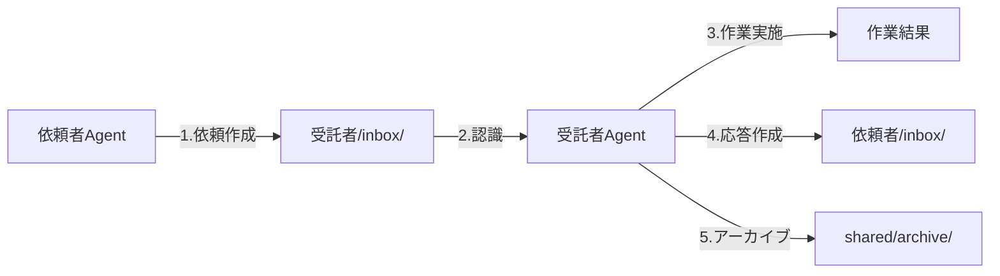

---
**アーカイブ情報**
- アーカイブ日: 2025-06-16
- アーカイブ週: 2025/0616-0622
- 元パス: documents/records/reports/
- 検索キーワード: エージェント間受け渡しシステム, 5エージェント体制通信設計, 非同期性トレーサビリティ, ファイルベースコミュニケーション, passage-handoffs構造, inbox-outbox設計, user-architect-builder-validator-clerk, 明示性追跡可能性独立性, REP-0075通信アーキテクチャ統合, Coder削除Architect追加, エージェント別典型依頼, 直接通信禁止制約, 実用的コミュニケーション機構, 作業受け渡し効率化, リアルタイム性期待しない

---

# REP-0022: エージェント間受け渡しシステム設計書

**作成日**: 2025年6月16日  
**更新日**: 2025年6月18日  
作成者: Clerk Agent  
更新者: Clerk Agent  
ステータス: 実装済み（handoffs/構造変更反映）  

## 更新履歴
- 2025-06-18: handoffs/をpassage/handoffs/に移動（REP-0075通信アーキテクチャ統合）、inbox/outbox構造に変更、userをエージェントとして追加
- 2025-06-18: 5エージェント体制への更新（Coder削除、Architect追加）、エージェント別典型依頼を更新  

## 1. 概要

5エージェント体制において、エージェント間で効率的に作業を受け渡すためのシステム設計。非同期性とトレーサビリティを重視した、実用的なコミュニケーション機構を提案する。

## 2. 設計原則

### 2.1 基本原則
1. **非同期性**: エージェントは同時にアクティブではない
2. **明示性**: 依頼内容と期待結果を明確に記述
3. **追跡可能性**: すべての依頼と応答を記録
4. **独立性**: 各エージェントは自律的に判断・行動

### 2.2 制約事項
- エージェント間の直接通信は不可
- ファイルベースのコミュニケーションのみ
- リアルタイム性は期待しない

## 3. 提案するシステム構造

### 3.1 ディレクトリ構造

```
passage/handoffs/                # 通信アーキテクチャ統合（REP-0075準拠）
├── user/                        # ユーザーも1つのエージェントとして扱う
│   ├── inbox/                   # ユーザーへの報告・質問
│   └── outbox/                  # ユーザーからの指示・要求
├── architect/
│   ├── inbox/                   # Architectへの依頼
│   └── outbox/                  # Architectからの設計・応答
├── builder/
│   ├── inbox/                   # Builderへの依頼
│   └── outbox/                  # Builderからの成果物・応答
├── validator/
│   ├── inbox/                   # Validatorへの依頼
│   └── outbox/                  # Validatorからの検証結果
├── clerk/
│   ├── inbox/                   # Clerkへの依頼
│   └── outbox/                  # Clerkからの文書・応答
├── inspector/
│   ├── inbox/                   # Inspectorへの依頼
│   └── outbox/                  # Inspectorからの分析結果
└── shared/                      # 共有リソース
    ├── templates/               # 依頼テンプレート
    │   ├── architecture-review.md
    │   ├── code-review.md
    │   ├── test-request.md
    │   ├── documentation.md
    │   └── bug-report.md
    └── archive/                 # 完了済みアーカイブ
        └── 2025-06/
```

### 3.2 ファイル命名規則

```
HO-YYYYMMDD-XXX-[from]-to-[to]-[title].md
```

例:
- `HO-20250616-001-builder-to-validator-auth-module-test.md`
- `HO-20250616-002-validator-to-builder-test-failures.md`

## 4. ワークフロー

### 4.1 基本フロー



### 4.2 具体例: BuilderからValidatorへ

1. **Builder**: 新機能実装完了
2. **Builder**: `validator/inbox/HO-20250616-001-builder-to-validator-user-auth.md`作成
3. **Builder**: 同時に`builder/outbox/`にコピーを配置（送信履歴）
4. **Validator**: セッション開始時に`validator/inbox/`確認
5. **Validator**: テスト実施
6. **Validator**: 結果レポートを`builder/inbox/HO-20250616-001-response.md`として作成
7. **Validator**: 同時に`validator/outbox/`にコピーを配置
8. **Both**: 月次で`shared/archive/2025-06/`へ移動

## 5. ファイルフォーマット

### 5.1 依頼テンプレート

```markdown
# HO-YYYYMMDD-XXX: [タイトル]

## メタ情報
- 依頼者: [Agent名]
- 受託者: [Agent名]  
- 作成日時: YYYY-MM-DD HH:MM
- 優先度: [High/Medium/Low]
- 期限: [あれば記載]

## 依頼内容
[具体的な依頼事項]

## 背景・コンテキスト
[なぜこの依頼が必要か]

## 期待する成果物
- [ ] 成果物1
- [ ] 成果物2

## 参照情報
- 関連ファイル: 
- 関連issue:
- 前回の依頼: 

---
## 応答セクション（受託者記入）

### 受託情報
- 受託日時: 
- 開始日時:
- 完了日時:

### 作業結果
[実施内容と結果]

### 成果物
- [x] 成果物1: [ファイルパスや説明]
- [x] 成果物2: [ファイルパスや説明]

### フォローアップ
[追加で必要な作業があれば記載]
```

## 6. エージェント別の典型的な依頼

### 6.1 To Architect
- 新機能設計依頼（from User）
- 技術選定相談（from Builder）
- アーキテクチャ改善提案（from Inspector）
- 設計レビュー依頼（from Validator）
- 技術的判断要請（from all）

### 6.2 To Builder
- 機能実装依頼（from Architect）
- バグ修正依頼（from Validator）
- リファクタリング提案（from Inspector）
- コード変更依頼（from User）
- 技術検証実装（from Architect）

### 6.3 To Validator  
- テスト実行依頼（from Builder）
- パフォーマンス測定（from Architect）
- 回帰テスト（from Builder）
- デプロイ前検証（from User）
- 品質保証確認（from Architect）

### 6.4 To Clerk
- ドキュメント更新（from all）
- プロセス改善提案（from all）
- インシデント報告（from all）
- 仕様書作成（from Architect）
- README更新（from Builder/Validator）

### 6.5 To Inspector
- 統計情報収集（from Clerk）
- パフォーマンス分析（from Architect）
- 異常検知設定（from Validator）
- システム監視（from User）
- コード品質分析（from Builder）

## 7. 運用ルール

### 7.1 確認タイミング
各エージェントはセッション開始時に必ず以下を確認：
1. `documents/agents/status/[agent].md`の現在の作業
2. `passage/handoffs/[agent]/inbox/`の新規依頼
3. `passage/handoffs/user/inbox/`の報告・質問事項（ユーザーへの通知）

### 7.2 優先度ルール
- **High**: 即座に対応（他の作業を中断）
- **Medium**: 現在の作業完了後に対応
- **Low**: 時間があるときに対応

### 7.3 エスカレーション
- 3日以上pendingの場合、依頼者が確認
- 対応不可の場合、理由を記載して返却

### 7.4 アーカイブ
- 各エージェントのinbox/outbox/は処理完了後も1週間保持
- 週次で`shared/archive/YYYY-MM/`へ移動
- 3ヶ月以上前のものは圧縮保存

## 8. 導入ステップ

### Phase 1: 基本構造（1時間）
1. passage/handoffs/ディレクトリ作成（通信アーキテクチャ統合）
2. 各エージェント用inbox/outbox/作成
3. shared/templates/に基本テンプレート配置
4. 各エージェントのstatus更新でhandoffs確認を追加

### Phase 2: 試験運用（1週間）
1. 簡単な依頼から開始
2. フォーマットの調整
3. 運用上の課題収集

### Phase 3: 本格運用
1. すべての依頼をこのシステムで管理
2. 月次レビューで改善

## 9. 期待効果

1. **明確な責任分界**: 誰が何を待っているか明確
2. **作業の可視化**: すべての依頼が記録される
3. **品質向上**: レビュープロセスの確立
4. **知識の蓄積**: 過去の依頼が参照可能

## 10. 課題と対策

### 10.1 課題
- ファイル数の増加
- 応答遅延の可能性
- 緊急時の対応

### 10.2 対策
- 定期的なアーカイブ
- SLAの設定（優先度別）
- 緊急フラグの導入

## 11. バグレポート管理

### 11.1 バグ発見から修正までのフロー

REP-0020からの引き継ぎ事項に基づき、以下を決定：

#### 基本フロー
1. **発見**: 任意のエージェントがバグを発見
2. **記録**: 発見者が`documents/records/bugs/`に記録
3. **依頼作成**: 
   - Validator → Builder: `builder/inbox/`にテスト失敗の詳細と再現手順
   - Builder → Validator: `validator/inbox/`に修正後の検証依頼
   - Inspector → Builder: `builder/inbox/`にパフォーマンス問題の報告
   - All → User: `user/inbox/`に重要なバグの報告
   - User/Builder → Architect: `architect/inbox/`に設計上の問題報告
4. **優先度判定**: ユーザーまたはArchitectが技術的観点から判定
5. **修正**: Builderが実装（必要に応じてArchitectが設計変更）
6. **検証**: Validatorがテスト
7. **完了**: 修正確認後、バグレポートをクローズ、関連ファイルをarchive/へ

#### 責任分担
- **Architect**: 設計上の問題判断・優先度決定・技術的方向性
- **Builder**: バグ修正の実装責任・コード変更
- **Validator**: バグの検証・テストケース作成・品質保証
- **Inspector**: システム観点からのバグ検出・統計分析
- **Clerk**: プロセス管理・記録整備・ドキュメント更新

### 11.2 バグレポートの管理ルール

#### ファイル管理
- 場所: `documents/records/bugs/`
- 命名: `BUG-YYYYMMDD-XXX-title.md`
- ステータス: ファイル内に記載（Open/In Progress/Resolved/Closed）

#### 優先度基準
- **Critical**: システム停止・データ損失リスク
- **High**: 主要機能の不具合
- **Medium**: 副次的機能の問題
- **Low**: UIの微調整・改善要望

## 12. ユーザーとの連携

### 12.1 ユーザーをエージェントとして扱う利点
1. **統一的なインターフェース**: すべての通信が同じ仕組みで管理される
2. **非同期性の活用**: ユーザーも常時接続している必要がない
3. **履歴の可視化**: ユーザーとのやり取りも記録・追跡可能
4. **明示的な依頼**: ユーザーからの要求も構造化される

### 12.2 ユーザー特有のワークフロー

#### ユーザーへの報告・質問（user/inbox/）
- **進捗報告**: 各エージェントが定期的に進捗を報告
- **判断依頼**: 技術的選択や優先度の判断を求める
- **承認要求**: 大きな変更や本番デプロイの承認
- **問題報告**: ブロッカーや重大な問題の報告

#### ユーザーからの指示（user/outbox/）
- **新規タスク**: 新しい機能要求やバグ報告
- **優先度変更**: タスクの優先順位の調整
- **フィードバック**: 成果物へのレビューコメント
- **方針決定**: アーキテクチャや実装方針の指示

## 13. エージェント間通信の詳細

### 13.1 同期的タスクの扱い

REP-0020からの引き継ぎ事項：

#### 複数エージェントが関わるタスク
1. **設計→実装→テスト**の一連フロー
   - Architect（設計）→ Builder（実装）→ Validator（テスト）の順次依頼
   - 各ステップでhandoffs/を経由
   
2. **並行作業の調整**
   - 複数のBuilderが同じモジュールを編集する場合
   - Architectまたはユーザーが技術的観点から調整

### 13.2 コンテキスト共有方法

#### 共有すべき情報
- 作業の背景・目的
- 関連する仕様書・設計書へのリンク
- 前回の作業結果
- 既知の問題・制約

#### 共有方法
1. **依頼ファイル内**: 背景・コンテキストセクションに記載
2. **関連ファイルリンク**: 依頼内で明示的に参照
3. **共有リソース**: `handoffs/shared/`に共通参照資料を配置
4. **大規模プロジェクト**: `handoffs/shared/projects/`にプロジェクト別コンテキスト

## 14. 移行期間中の運用詳細

REP-0020からの引き継ぎ事項：

### 14.1 5エージェント体制での作業分担

#### 各エージェントの明確な役割
1. **Architect**: 設計・技術判断・アーキテクチャ決定
   - 新機能の設計書作成
   - 技術選定と評価
   - システム全体の整合性維持

2. **Builder**: 実装・コード作成・技術実装
   - Architectの設計に基づく実装
   - バグ修正とリファクタリング
   - 技術的な検証実装

3. **Validator**: テスト・品質保証・デプロイ
   - 単体・結合テストの実施
   - パフォーマンステスト
   - デプロイ前の最終確認

#### 作業の流れ
- **新機能**: User → Architect → Builder → Validator → User
- **バグ修正**: Validator/Inspector → Builder → Validator
- **改善提案**: Inspector → Architect → Builder → Validator

### 14.2 エージェント切り替えの実運用

#### 切り替え頻度の目安
- **1日1-2回**: 通常の開発サイクル
- **タスク単位**: 1つのタスクは可能な限り同一セッションで
- **緊急時**: 必要に応じて即座に切り替え

#### コンテキスト維持方法
1. **handoffs/の活用**: 詳細な引き継ぎ情報を記載
2. **status更新の徹底**: 各エージェントが最新状態を記録
3. **共有コンテキストファイル**: 大規模案件では専用ファイル作成

### 14.3 メッセージパッシングの実装

#### 基本実装（ファイルベース）
```
1. 依頼者: 受託者/inbox/に依頼作成
2. 依頼者: 自身のoutbox/にコピー保存
3. 受託者: セッション開始時にinbox/確認
4. 受託者: 作業実施
5. 受託者: 依頼者/inbox/に応答作成
6. 受託者: 自身のoutbox/にコピー保存
7. 両者: 週次でshared/archive/へ移動
```

#### 将来的な自動化の可能性
- Git hooksでの新規依頼検知
- 簡易通知スクリプトの作成
- 依頼状況のダッシュボード化

## 15. 将来の拡張

1. **自動化**: スクリプトによる定型依頼の自動生成
2. **通知**: 新規依頼時の通知機能
3. **ダッシュボード**: 依頼状況の可視化
4. **メトリクス**: 応答時間、完了率の測定
5. **テンプレート拡充**: より多様な依頼パターンへの対応
6. **Architect統合**: 設計レビューの自動化・技術判断支援ツール

---

## 参照URL

**関連レポート**:
- REP-0020: 5エージェント体制移行計画書（上位計画）
- REP-0021: Validator環境設計書（テストフローの詳細）
- REP-0024: MCPサーバー統合調査レポート（将来的な通信方式）
- REP-0049: Coder分割第1段階実装計画（Builder/Validator分離の詳細）

**インスピレーション元**:
- [How I built a multi-agent orchestration system using Claude Code and MCP](https://www.reddit.com/r/ClaudeAI/comments/1l11fo2/how_i_built_a_multiagent_orchestration_system/) - ファイルベース通信の実装例

---

## 疑問点・決定事項

### 決定事項
1. **handoffs/配置**: ワークスペースルート直下（documents/外）
2. **ディレクトリ構造**: 各エージェント別inbox/outbox/とshared/の構成
3. **ユーザーの扱い**: userも1エージェントとしてinbox/outbox/を持つ
4. **ファイル命名規則**: HO-YYYYMMDD-XXX-[from]-to-[to]-[title].md形式
5. **バグ管理フロー**: 発見→記録→依頼→修正→検証の5ステップ
6. **優先度基準**: Critical/High/Medium/Lowの4段階
7. **アーカイブ**: 週次でshared/archive/YYYY-MM/へ移動

### 疑問点（運用開始後の調整事項）
1. **エスカレーションルール**: 3日以上pendingの場合の具体的対応
2. **アーカイブルール**: 3ヶ月前のファイル移動の自動化
3. **通知システム**: Git hooksやスクリプトでの実装可能性
4. **ダッシュボード**: 依頼状況の可視化ツール
5. **テンプレート拡充**: 運用中に発生する新しい依頼パターンへの対応

---
以上