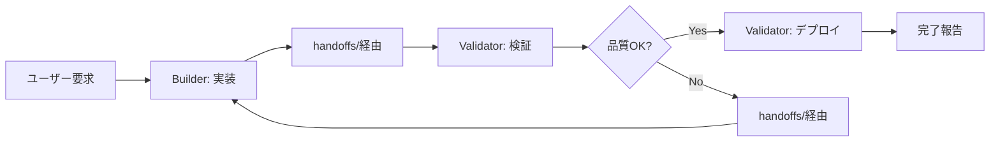

---
**アーカイブ情報**
- アーカイブ日: 2025-06-23
- アーカイブ週: 2025/0616-0622
- 元パス: documents/records/reports/
- 検索キーワード: Coder分割実装計画, Builder Validatorエージェント, 5エージェント体制第1段階, 実装検証責任分離, handoffsシステム確立, REP-0022準拠受け渡し, 段階的移行計画, Builder権限範囲, Validator品質検証, 作業フロー設計, Phase1-3移行スケジュール, リスク管理対策, 効果測定指標, Monitor Inspector変更知見活用, コード品質向上, デプロイ管理分離

---

# REP-0049: Coder分割実装計画（第1段階）

**作成日**: 2025年6月18日 04:40  
**作成者**: Clerk Agent  
**ステータス**: 計画策定中  
**関連**: REP-0034（5エージェント体制実装計画書）、DDD1  
**参照URL**: 
- Monitor→Inspector変更の知見（REP-0045、REP-0046、REP-0047）

## 疑問点・決定事項
- [x] 段階的移行の必要性確認（Monitor→Inspector変更の教訓）
- [x] 第1段階対象の決定（Coder → Builder + Validator）
- [x] 役割分担の基本方針策定
- [ ] 権限マトリックスの詳細設計
- [ ] handoffs/システムの実装仕様
- [ ] 移行スケジュールの確定

## 📋 概要

5エージェント体制移行の第1段階として、Coderエージェントを Builder（実装担当）と Validator（検証担当）に分割する。Monitor→Inspector変更で得た知見を活用し、段階的かつ安全な移行を実現する。

## 🎯 第1段階の目標

### 主要目標
1. **Coder機能の適切な分割**: 実装と検証の責任分離
2. **handoffs/システムの確立**: Builder→Validator間の効率的受け渡し
3. **段階的移行**: 既存作業への影響最小化
4. **知見の蓄積**: 第2段階（Clerk分割）への準備

### 成功指標
- Builder/Validator間の作業フロー確立
- 既存Coderタスクの円滑な移行
- handoffs/システムの実用性証明
- ユーザー体験の維持・向上

## 👥 新エージェント役割定義

### Builder Agent
**基本職責**: 機能実装・コード作成・技術実装

#### 主要責務
- **コード実装**: 新機能・改修・バグ修正の実装
- **技術設計**: 実装レベルの技術設計・アーキテクチャ決定
- **開発ツール**: 開発環境・ビルドシステムの管理
- **初期テスト**: 基本動作確認・単体テスト実装

#### 権限範囲
- ✅ `src/` - 全ソースコード（フロントエンド・バックエンド）
- ✅ `package.json`, `composer.json` - 依存関係管理
- ✅ 開発関連設定ファイル
- ✅ 実装に必要な一時ファイル作成

#### 制限事項
- ❌ 本番デプロイの実行
- ❌ 品質ゲートの最終判定
- ❌ リリース判定・承認
- ❌ documents/techs/specifications/, documents/techs/roadmaps/の編集（Clerk専用）
- ✅ documents/records/, documents/agents/status/, documents/archives/へのアクセス許可（記録系）

### Validator Agent  
**基本職責**: 品質検証・テスト・デプロイ・品質保証

#### 主要責務
- **品質検証**: コード品質・セキュリティ・パフォーマンス検証
- **テスト実行**: 統合テスト・E2Eテスト・回帰テスト
- **デプロイ管理**: 本番デプロイ・ロールバック・環境管理
- **品質ゲート**: リリース可否の最終判定

#### 権限範囲
- ✅ `src/` - 読み取り専用（検証目的）
- ✅ `tests/`, `cypress/` - テスト関連ディレクトリ
- ✅ デプロイ設定・CI/CD設定
- ✅ 本番環境へのデプロイ実行
- ✅ `dist/`, `build/` - ビルド成果物

#### 制限事項
- ❌ ソースコードの直接編集（緊急時以外）
- ❌ documents/techs/specifications/, documents/techs/roadmaps/の編集（Clerk専用）
- ❌ 仕様変更の独断決定
- ✅ documents/records/, documents/agents/status/, documents/archives/へのアクセス許可（記録系）

## 🔄 作業フロー設計

### 標準フロー: Builder → Validator

### 詳細ステップ
1. **Builder段階**
   - 要求分析・技術設計
   - コード実装・初期テスト
   - REP-0022形式でhandoffs/pending/to-validator/に依頼作成

2. **受け渡し段階**
   - REP-0022 § 4.1基本フローに従い受け渡し実行
   - HO-YYYYMMDD-XXX-builder-to-validator-[title].md作成
   - 実装内容・テスト手順・デプロイ手順を標準テンプレートで文書化

3. **Validator段階**
   - handoffs/in-progress/validator/へ移動し作業開始
   - コード品質検証・セキュリティチェック
   - 統合テスト・E2Eテスト実行・品質ゲート判定
   - 完了後handoffs/completed/へ移動

## 📁 エージェント間受け渡しシステム

### 基本方針
Builder→Validator間の作業受け渡しには、**REP-0022（エージェント間受け渡しシステム設計書）**で設計された包括的なhandoffs/システムを使用します。

### REP-0022適用項目
- **ディレクトリ構造**: `handoffs/pending/to-validator/`, `handoffs/in-progress/`, `handoffs/completed/`
- **ファイル命名規則**: `HO-YYYYMMDD-XXX-builder-to-validator-[title].md`
- **受け渡しテンプレート**: REP-0022 § 5.1の標準テンプレート使用
- **ワークフロー**: REP-0022 § 4の基本フロー適用

### Builder→Validator特化部分
REP-0022の汎用設計を基に、以下をBuilder→Validator固有として定義：
- **優先度判定**: High（緊急バグ）、Medium（新機能）、Low（改善要望）
- **期待成果物**: コード品質検証、統合テスト実行、デプロイ可否判定
- **SLA**: High（24時間以内）、Medium（3日以内）、Low（1週間以内）

**詳細**: REP-0022を参照してください。

## 🚧 移行計画

### Phase 1: 基盤準備（3日間）
#### Day 1: 役割定義・権限設計
- DDD1更新（Builder/Validator追加）
- P016更新（新権限マトリックス）
- handoffs/ディレクトリ構造作成

#### Day 2: handoffs/システム実装
- REP-0022に基づくhandoffs/ディレクトリ構造作成
- Builder→Validator固有の運用ルール文書化
- 初期テストケース準備

#### Day 3: 文書整備
- status/builder.md, status/validator.md作成
- 既存Coderタスクの分類・移行計画
- トレーニング用ドキュメント準備

### Phase 2: 段階的移行（4日間）
#### Day 4-5: パイロット運用
- 小規模タスクでのBuilder/Validator協調テスト
- handoffs/フロー検証・改善
- 問題点の洗い出し・修正

#### Day 6-7: 本格移行
- 既存Coderタスクの段階的移行
- Builder/Validator間のワークフロー最適化
- ユーザーフィードバック収集・反映

### Phase 3: 安定化・最適化（3日間）
#### Day 8-9: プロセス最適化
- 作業効率の測定・改善
- handoffs/システムの改良
- エージェント間協調の強化

#### Day 10: 完了・評価
- 移行完了確認・評価
- 知見の文書化（REP-0050作成）
- 第2段階（Clerk分割）準備開始

## ⚠️ リスク管理

### 主要リスク
| リスク | 影響度 | 対策 |
|--------|---------|------|
| Builder/Validator間の責任境界曖昧 | 高 | 詳細な役割定義・判断基準明文化 |
| handoffs/オーバーヘッド増大 | 中 | テンプレート標準化・効率化 |
| 既存作業フローの混乱 | 高 | 段階的移行・十分な準備期間 |
| エージェント間コミュニケーション不全 | 中 | 明確な受け渡し手順・フォーマット |

### 緊急時対応
- **即座復旧**: 既存Coderエージェントへの一時復帰手順
- **責任代行**: Builder/Validatorいずれかが不在時の代替手順
- **エスカレーション**: 判断困難時のユーザー確認プロセス

## 📊 効果測定

### 定量指標
- Builder→Validator受け渡し回数・成功率
- 平均作業完了時間（分割前後比較）
- 品質問題発生率（デプロイ後バグ数）
- ユーザー満足度（作業品質・速度）

### 定性指標
- Builder/Validator各エージェントの専門性向上
- 作業品質の向上（コードレビュー効果）
- 責任分担の明確化による効率向上
- 第2段階移行への知見蓄積

## 🔗 関連文書

### 既存文書
- **DDD1**: Agent役割必須システム（更新予定）
- **P016**: Agent権限マトリックス（更新予定）
- **REP-0022**: エージェント間受け渡しシステム設計書（handoffs/システム仕様）
- **REP-0034**: 5エージェント体制実装計画書
- **status/coder.md**: 現行Coder権限・責務（移行元）

### 新規作成予定
- **status/builder.md**: Builder Agent状況管理
- **status/validator.md**: Validator Agent状況管理

## 📅 実施タイミング

### 開始条件
- REP-0041の一定進捗（P042プロセス完了後）
- ユーザーの最終承認
- 十分な準備期間確保

### 期間
- **準備期間**: 1週間（設計・文書作成）
- **移行期間**: 10日間（上記Phase 1-3）
- **評価期間**: 3日間（効果測定・知見整理）

---

## 更新履歴

- 2025年6月18日 05:10: handoffs/システム重複削除、REP-0022参照に統一（Inspector Agent）
- 2025年6月18日 04:55: ユーザー指摘反映、documents/記録系アクセス権限を明確化（Clerk Agent）
- 2025年6月18日 04:40: 初版作成（Clerk Agent）- Coder分割実装計画策定

**策定背景**: 5エージェント体制移行をMonitor→Inspector変更の知見を活かして段階的に実施。第1段階としてCoder分割による実装・検証責任の分離を実現。