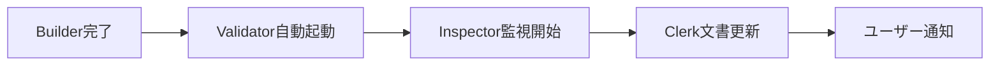

---
**アーカイブ情報**
- アーカイブ日: 2025-06-23
- アーカイブ週: 2025/0616-0622
- 元パス: documents/records/reports/
- 検索キーワード: 開発環境アーキテクチャ設計, 自律的エージェントオーケストレーション, MCPサーバー管理, 5エージェント体制連携, handoffsシステム統合, ユーザーエージェント化, コンテキスト局所化, 並列Task生成, 自律的判断メカニズム, イベントドリブンアーキテクチャ, 開発効率3-5倍向上, Builder Validator協調, パフォーマンス最適化, セキュリティアクセス制御, Phase1-4移行計画

---

# REP-0062: 開発環境アーキテクチャと自律的エージェントオーケストレーション

**作成日**: 2025年6月18日 08:20  
**作成者**: Clerk Agent  
**ステータス**: 提案  
**カテゴリー**: 開発環境・エージェントアーキテクチャ  
**関連文書**: 
- REP-0032: データ並列型処理プロトコル（MCP活用）
- REP-0049: Coder分割実装計画（5エージェント体制）
- externals/cache/summaries/talk-with-ChatGPT-about-mcp-summary.md

## 疑問点・決定事項
- [ ] MCPサーバーの選定と配置
- [ ] エージェント間の連携方法
- [ ] 開発・テスト・本番環境の分離
- [ ] ローカル vs クラウドの使い分け
- [ ] 各エージェントの自律度レベル
- [ ] ユーザー介入のタイミング
- [ ] エージェント間の調整メカニズム
- [ ] 失敗時のエスカレーション

---

## 1. 現状分析

### 1.1 蓄積された知見
1. **5エージェント体制**: Coder→Builder/Validator分割、Clerk、Inspector
2. **MCPの威力**: コンテキスト局所化による並列処理の実現
3. **handoffs/システム**: ワークスペースルート直下での非同期ファイルベース連携（ユーザーもエージェントとして参加）
4. **externals/キャッシュ**: 大容量ファイルの効率的管理

### 1.2 現在の課題
- 開発環境が場当たり的に構築されている
- MCPサーバーの体系的な管理がない
- エージェント間の連携が手動に依存
- パフォーマンス測定・最適化の仕組みが不足
- エージェントがユーザーの詳細な指示に依存（マイクロマネジメント）
- 自律的な判断・実行能力が限定的

## 2. 理想的な開発環境アーキテクチャ

### 2.1 階層構造

```
┌─────────────────────────────────────────────┐
│               ユーザー層                     │
│  目標設定 → 意思決定 → チェック＆バランス    │
│       （方向付けと最終判断に集中）           │
└─────────────────────────────────────────────┘
                    ↓
┌─────────────────────────────────────────────┐
│           ユーザーインターフェース層          │
│  - Claude Code CLI                          │
│  - Web UI (surveillance/)                   │
└─────────────────────────────────────────────┘
                    ↓
┌─────────────────────────────────────────────┐
│   自律的エージェント層（オーケストレーター）   │
│  ┌─────────┐ ┌─────────┐ ┌─────────┐    │
│  │ Builder │ │Validator│ │  Clerk  │    │
│  │  (開発) │ │ (品質) │ │ (文書) │    │
│  └─────────┘ └─────────┘ └─────────┘    │
│  ┌─────────┐ ┌─────────┐ ┌─────────┐    │
│  │Inspector│ │Architect│ │  User   │    │
│  │ (監視) │ │ (設計) │ │(エージェント)│ │
│  └─────────┘ └─────────┘ └─────────┘    │
│     各エージェントが自律的に：              │
│     - タスク分解・計画立案                  │
│     - 並列Task()生成・実行                  │
│     - エージェント間連携                    │
│     - 進捗管理・報告                        │
└─────────────────────────────────────────────┘
                    ↓
┌─────────────────────────────────────────────┐
│      エージェント間通信層（handoffs/）        │
│  ワークスペースルート直下に配置              │
│  - user/inbox, user/outbox                  │
│  - builder/inbox, builder/outbox            │
│  - validator/inbox, validator/outbox        │
│  - clerk/inbox, clerk/outbox               │
│  - inspector/inbox, inspector/outbox        │
│  - shared/templates, shared/archive         │
└─────────────────────────────────────────────┘
                    ↓
┌─────────────────────────────────────────────┐
│           MCPサーバー層                      │
│  - filesystem (ローカルファイル操作)         │
│  - GitHub/Git (バージョン管理)              │
│  - PostgreSQL/SQLite (データ永続化)         │
│  - Slack/Notion (コミュニケーション)        │
│  - Docker/K8s (コンテナ管理)               │
│  - fetch/browser (Web連携)                 │
└─────────────────────────────────────────────┘
                    ↓
┌─────────────────────────────────────────────┐
│            インフラ層                        │
│  - ローカル開発環境                         │
│  - テスト環境（Docker Compose）             │
│  - 本番環境（クラウド）                     │
└─────────────────────────────────────────────┘
```

### 2.2 コンポーネント詳細

#### A. エージェント管理
```yaml
agents:
  builder:
    mcp_servers:
      - filesystem
      - github
      - docker
    permissions:
      - src/**
      - tests/**
  
  validator:
    mcp_servers:
      - filesystem
      - github
      - docker
      - postgres
    permissions:
      - tests/**
      - dist/**
  
  clerk:
    mcp_servers:
      - filesystem
      - github
      - notion
    permissions:
      - documents/**
      - externals/cache/**
```

#### B. MCPサーバー構成
```bash
# 開発環境のMCPサーバー起動スクリプト
#!/bin/bash
# start-mcp-servers.sh

# 基本MCPサーバー
claude mcp add filesystem npx @modelcontextprotocol/server-filesystem .
claude mcp add github npx @modelcontextprotocol/server-github
claude mcp add postgres npx @modelcontextprotocol/server-postgres

# 開発用MCPサーバー
claude mcp add docker npx @modelcontextprotocol/server-docker
claude mcp add slack npx @modelcontextprotocol/server-slack

# 監視用MCPサーバー
claude mcp add prometheus npx @modelcontextprotocol/server-prometheus
```

## 3. 開発ワークフロー

### 3.1 従来のワークフロー vs 自律的ワークフロー

#### 従来のワークフロー（現在）


#### 自律的ワークフロー（理想）


### 3.2 自律的エージェントの実行例

#### Builder Agent as Orchestrator
```python
# Builderが自律的に開発タスクを分解・実行
claude code <<EOF
You are Builder Agent, acting as development orchestrator.
Goal: "TimeBoxアプリに新機能Xを追加"

自律的に以下を実行：
1. 機能要件の分析
2. 実装タスクへの分解
3. 各タスクのTask()生成と並列実行
4. 依存関係の管理
5. Validatorへの品質検証依頼
6. ユーザーへの進捗報告（チェックポイントで）
EOF
```

**実行例**：
```
Builder: 「新機能Xの実装を開始します。以下の計画で進めます：」
- Task A: データモデル設計（30分）
- Task B: API実装（45分）  
- Task C: UI実装（60分）
- Task D: 統合テスト（30分）

「Task A, Bを並列で開始します。問題があれば報告します。」
```

#### Clerk Agent as Orchestrator
```python
# Clerkがドキュメント管理を自律化
claude code <<EOF
You are Clerk Agent, acting as documentation orchestrator.
Goal: "プロジェクトドキュメントの整合性維持"

自律的に以下を実行：
1. 変更箇所の検出
2. 更新必要な文書の特定
3. 並列更新タスクの実行
4. 整合性チェック（P022実行）
5. レポート生成と次回タスクの計画
EOF
```

## 4. パフォーマンス最適化

### 4.1 コンテキスト管理
- **セッション分離**: エージェントごとに独立したコンテキスト
- **キャッシュ活用**: externals/cache/の積極利用
- **タスク粒度**: 5-10分で完了する粒度に分割

### 4.2 測定指標
```yaml
metrics:
  response_time:
    - agent_processing_time
    - mcp_server_latency
    - context_parsing_time
  
  resource_usage:
    - memory_consumption
    - token_usage
    - parallel_task_count
  
  quality:
    - task_success_rate
    - error_recovery_time
    - code_quality_score
```

## 5. ユーザーの新しい役割

### 5.1 方向付け（Direction Setting）
```yaml
ユーザーの発話例:
  - "TimeBoxに時間追跡機能を追加したい"
  - "パフォーマンスを50%改善して"
  - "来月までにv2.0をリリースしたい"
```

### 5.2 意思決定ポイント（Decision Points）
```yaml
エージェントからの確認:
  builder: "設計案を3つ用意しました。どれがよいですか？"
  validator: "重大なリスクを発見。続行しますか？"
  clerk: "ドキュメント構造の大幅変更を提案。承認しますか？"
```

### 5.3 チェック＆バランス
```yaml
定期レビュー:
  daily: "本日の進捗：タスク10件完了、問題2件"
  weekly: "今週の成果と来週の計画"
  milestone: "v1.5リリース準備完了。最終確認を"
```

## 6. エージェント間の自律的連携

### 6.1 イベントドリブンアーキテクチャ


### 6.2 共有コンテキスト最小化
```python
# handoffs/を通じた最小限の情報共有（ワークスペースルート直下）
# 例: /workspace/handoffs/validator/inbox/HO-20250618-001-builder-to-validator-feature-x.md
{
    "from": "builder",
    "to": "validator", 
    "task": "validate_feature_x",
    "context": {
        "files_changed": ["src/feature_x.js"],
        "test_required": true
    }
    # 詳細なコンテキストは不要
}
```

## 7. handoffs/システムとの統合

### 7.1 配置構造
```
workspace/
├── documents/         # ドキュメント類
├── src/              # ソースコード
├── surveillance/      # 監視システム
└── handoffs/         # エージェント間通信（ワークスペースルート）
    ├── user/
    │   ├── inbox/    # ユーザーへの報告・質問
    │   └── outbox/   # ユーザーからの指示
    ├── builder/
    │   ├── inbox/    # Builderへの依頼
    │   └── outbox/   # Builderからの成果物
    ├── validator/
    │   ├── inbox/    # Validatorへの検証依頼
    │   └── outbox/   # 検証結果レポート
    └── shared/
        └── templates/ # 共通テンプレート
```

### 7.2 ユーザーエージェントとしての役割
```yaml
user_agent:
  inbox:
    - 進捗報告
    - 意思決定要求
    - エスカレーション
    - 完了通知
  outbox:
    - 新規タスク指示
    - 優先度変更
    - 承認/却下
    - フィードバック
```

### 7.3 自律的エージェントの活用例
```python
# Builderが自律的に判断してユーザーに確認を求める例
if critical_decision_required:
    handoff = {
        "file": "handoffs/user/inbox/HO-20250618-001-builder-to-user-architecture-decision.md",
        "content": """
        # アーキテクチャ判断依頼
        
        ## 状況
        新機能Xの実装で2つのアプローチがあります：
        
        ### Option A: マイクロサービス化
        - 利点：スケーラビリティ、独立性
        - 欠点：複雑性増加、初期コスト
        
        ### Option B: モノリス内実装  
        - 利点：シンプル、迅速
        - 欠点：将来の拡張性制限
        
        ## 推奨
        現段階ではOption Bを推奨します。
        
        承認いただけますか？
        """
    }
```

## 8. 技術的実現方法

### 8.1 プロンプトエンジニアリング
```python
# エージェントの自律性を高めるプロンプト構造
system_prompt = """
You are {agent_name}, an autonomous orchestrator.
Your primary directive: Achieve goals with minimal user intervention.

Capabilities:
1. Break down high-level goals into executable tasks
2. Spawn parallel Task() instances
3. Coordinate with other agents via handoffs/
4. Make decisions within defined boundaries
5. Escalate only critical decisions to user

Decision framework:
- Routine decisions: Execute autonomously
- Important decisions: Propose options to user
- Critical decisions: Require explicit approval
"""
```

### 8.2 メモリと学習
```yaml
agent_memory:
  decision_history:
    - context: "feature implementation"
      user_preference: "test-first approach"
      
  task_patterns:
    - goal_type: "new feature"
      typical_tasks: ["design", "implement", "test", "document"]
      
  performance_metrics:
    - task_type: "code review"
      average_time: "30 minutes"
      success_rate: "95%"
```

## 8. 環境別構成

### 8.1 開発環境
```yaml
development:
  mcp_servers:
    - filesystem (local)
    - sqlite (local)
    - mock services
  agents:
    - all agents with debug mode
  features:
    - hot reload
    - verbose logging
    - test data generation
```

### 8.2 テスト環境
```yaml
testing:
  infrastructure: docker-compose
  mcp_servers:
    - filesystem (container)
    - postgres (container)
    - test doubles
  agents:
    - automated test agents
  features:
    - CI/CD integration
    - automated testing
    - performance profiling
```

### 8.3 本番環境
```yaml
production:
  infrastructure: cloud (sakura.ne.jp)
  mcp_servers:
    - filesystem (secure)
    - postgres (managed)
    - real services
  agents:
    - production-ready agents
  features:
    - monitoring
    - backup
    - security hardening
```

## 9. セキュリティ考慮事項

### 9.1 アクセス制御
- エージェントごとの権限分離（P016準拠）
- MCPサーバーへのアクセス制限
- 機密情報の暗号化

### 9.2 監査
- 全エージェント操作のログ記録
- MCPサーバーアクセスの追跡
- 定期的なセキュリティレビュー

## 10. 移行計画

### Phase 1: 基盤整備（1-2週間）
1. MCPサーバー選定と設定
2. 起動スクリプト作成
3. 基本的な開発フロー確立

### Phase 2: 自律性基礎能力構築（2週間）
1. MCPタスク生成能力の実装
2. 計画立案能力の開発
3. 進捗管理能力の実装
4. handoffs/システムとの連携（ワークスペースルート）
5. 各エージェントのMCP設定
6. パフォーマンス測定開始

### Phase 3: 自律性向上（1ヶ月）
1. 判断基準の学習
2. エラー対応の自律化
3. 最適化アルゴリズムの実装

### Phase 4: 完全自律化（3ヶ月）
1. 予測的行動の実装
2. 創造的提案の生成
3. 自己改善メカニズム
1. ボトルネック分析
2. 並列度の調整
3. キャッシュ戦略の改善

## 11. 期待効果

### 11.1 開発効率
- **開発速度**: 3-5倍向上（自律的並列処理）
- **コンテキスト切り替え**: 90%削減（局所化）
- **認知負荷**: 80%削減（マイクロマネジメントからの解放）
- **エラー率**: 50%削減（自動化）

### 11.2 保守性
- 環境構築の自動化
- 再現可能な開発環境
- 明確な責任分離
- 自律的な品質維持

### 11.3 イノベーション
- エージェントによる創造的問題解決
- ユーザーの戦略的思考への集中
- 継続的なプロセス改善

## 12. リスクと対策

### 12.1 過度の自律性
- **リスク**: ユーザー意図との乖離
- **対策**: 定期的なチェックポイント、明確な境界設定

### 12.2 エージェント間の衝突
- **リスク**: 相反する判断や行動
- **対策**: 優先順位ルール、調停メカニズム

### 12.3 品質管理
- **リスク**: 自律判断による品質低下
- **対策**: Validatorの権限強化、品質基準の明確化

## 13. 次のステップ

1. **環境構成の承認**: 本提案のレビューと承認
2. **MCPサーバー選定**: 必要なサーバーの最終決定
3. **パイロット実装**: 小規模な環境で検証
4. **段階的展開**: Phase 1から順次実施
5. **プロンプト設計**: 自律性を高めるプロンプトの開発
6. **評価基準策定**: 成功指標の定義

---

## 結論

本提案は、開発環境の体系化と自律的エージェントオーケストレーションを統合したものです。エージェントが自律的なオーケストレーターとして機能することで、開発効率と品質の飛躍的向上を実現します。ユーザーは真に重要な意思決定に集中でき、エージェントは創造的な問題解決に取り組めるようになります。

この構想は、単なる自動化を超えた、人間とAIの理想的な協働モデルを示しています。

---

## 更新履歴

- 2025年6月18日 08:20: 初版作成（Clerk Agent）- 開発環境アーキテクチャの体系的整理提案
- 2025年6月18日 08:40: REP-0063（自律的エージェントオーケストレーション）の内容を統合（Clerk Agent）
  - ユーザーの新しい役割（セクション5）
  - エージェント間の自律的連携（セクション6）
  - 技術的実現方法（セクション7）
  - 自律性向上の段階的移行計画（Phase 2-4）
  - リスクと対策（セクション12）
- 2025年6月18日: handoffs/配置の更新（Coder Agent）
  - アーキテクチャ図にhandoffs/通信層を追加（セクション2.1）
  - handoffs/がワークスペースルート直下にあることを明記
  - ユーザーをエージェントとして追加（セクション2.1、7.2）
  - handoffs/システムとの統合詳細を追加（セクション7）
  - 自律的エージェントの活用例を追加（セクション7.3）