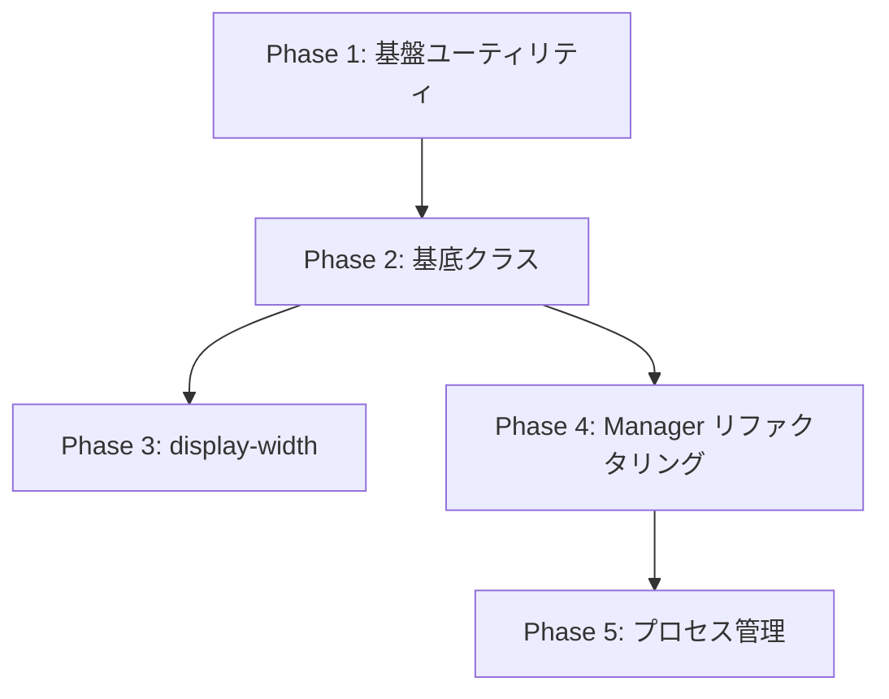

# PLAN-20250629-001: TypeScript Code Duplication Refactoring Plan

**作成日**: 2025-06-29  
**作成者**: Builder  
**状態**: Active  
**優先度**: High  

## 概要

similarity-tsツールおよび詳細分析により、cctopコードベースに12種類の重複パターンを検出。本計画書では、これらの重複を段階的に解消し、保守性・拡張性を向上させる。

## 検出された重複パターン

### 1. similarity-ts検出結果
- **display-width.ts**: padEndWithWidth/padStartWithWidth (92.58%類似度)

### 2. 詳細分析による追加検出
1. **エラーハンドリングパターン**: try-catch, error.code判定
2. **Manager初期化パターン**: constructor内のconfig/verbose/debug設定
3. **非同期Load/Getメソッド**: checkExists→readData→parseDataの流れ
4. **ファイルシステムチェック**: fs.existsSync重複
5. **デバッグログ出力**: if(this.debug)パターン
6. **配列管理パターン**: addItem with重複チェック&最大数制限
7. **設定検証パターン**: validateConfig構造
8. **プロセス管理パターン**: stopProcess/isProcessRunning
9. **ファイルI/O**: readFile/writeFile JSON処理
10. **配列+Map二重管理**: items配列とuniqueItemsマップ
11. **ステータス更新**: updateStatusと変更通知
12. **遅延初期化**: ensureInitialized パターン

## リファクタリング戦略

### Phase 1: 基盤ユーティリティ整備（優先度: 最高）

#### 1.1 エラーハンドリングユーティリティ
```typescript
// src/utils/error-handler.ts
export class ErrorHandler {
  static handleFileSystemError(error: any): FileSystemErrorResult
  static handleProcessError(error: any): ProcessErrorResult
  static isSpecificError(error: any, code: string): boolean
}
```

#### 1.2 ファイルシステムユーティリティ
```typescript
// src/utils/file-system.ts
export class FileSystemUtils {
  static async ensureDirectory(path: string): Promise<void>
  static async readJsonFile<T>(path: string): Promise<T | null>
  static async writeJsonFile(path: string, data: any): Promise<void>
  static async checkExists(path: string): Promise<boolean>
}
```

#### 1.3 デバッグユーティリティ
```typescript
// src/utils/debug.ts
export class DebugLogger {
  constructor(className: string, verbose?: boolean, debug?: boolean)
  log(message: string, ...args: any[]): void
  error(message: string, error?: any): void
}
```

### Phase 2: 基底クラス作成（優先度: 高）

#### 2.1 BaseManager抽象クラス
```typescript
// src/core/base-manager.ts
export abstract class BaseManager {
  protected config: any;
  protected logger: DebugLogger;
  protected initialized = false;
  
  async ensureInitialized(): Promise<void>
  protected abstract initialize(): Promise<void>
}
```

#### 2.2 BaseArrayManager<T>ジェネリッククラス
```typescript
// src/core/base-array-manager.ts
export abstract class BaseArrayManager<T> extends BaseManager {
  protected items: T[] = [];
  protected maxItems: number;
  
  addItem(item: T): void
  removeItem(predicate: (item: T) => boolean): boolean
  getItems(): T[]
  clear(): void
}
```

#### 2.3 BaseStatusManager抽象クラス
```typescript
// src/core/base-status-manager.ts
export abstract class BaseStatusManager extends BaseManager {
  protected status: Map<string, any> = new Map();
  
  updateStatus(key: string, value: any): void
  getStatus(key: string): any
  getAllStatus(): Record<string, any>
}
```

### Phase 3: display-width.ts重複解消（優先度: 中）

```typescript
// リファクタリング後
function padWithWidth(str: string, targetWidth: number, direction: 'start' | 'end'): string {
  const currentWidth = stringWidth(str);
  const padding = targetWidth - currentWidth;
  
  if (padding <= 0) {
    return truncateWithEllipsis(str, targetWidth);
  }
  
  const spaces = ' '.repeat(padding);
  return direction === 'start' ? spaces + str : str + spaces;
}

export const padEndWithWidth = (str: string, width: number) => padWithWidth(str, width, 'end');
export const padStartWithWidth = (str: string, width: number) => padWithWidth(str, width, 'start');
```

### Phase 4: 各Managerクラスのリファクタリング（優先度: 中）

1. **ConfigManager** → BaseManager継承
2. **ThemeManager** → BaseManager継承 + FileSystemUtils使用
3. **EventDataManager** → BaseArrayManager<Event>継承
4. **MessageManager** → BaseArrayManager<Message>継承
5. **ProcessController** → BaseManager継承 + ErrorHandler使用

### Phase 5: プロセス管理統一化（優先度: 低）

```typescript
// src/utils/process-utils.ts
export class ProcessUtils {
  static async isRunning(pid: number): Promise<boolean>
  static async gracefulStop(pid: number, timeout?: number): Promise<boolean>
  static async forceKill(pid: number): Promise<boolean>
}
```

## 実装順序と依存関係



## 期待される効果

1. **コード削減**: 約30-40%の重複コード削減
2. **保守性向上**: 共通ロジックの一元管理
3. **型安全性**: ジェネリック基底クラスによる型保証
4. **テスト効率化**: 基底クラスのテストで広範囲カバー
5. **拡張性**: 新規Manager追加時の実装工数削減

## リスクと対策

1. **後方互換性**: 全公開APIを維持、内部実装のみ変更
2. **段階的移行**: Phase毎に動作確認とテスト実施
3. **ロールバック**: Git履歴による即座の復元可能

## 完了基準

- [ ] 全Phaseのコード実装完了
- [ ] 既存テストの100%パス
- [ ] コードカバレッジ維持または向上
- [ ] similarity-ts再実行で重複度50%以下

## 次のアクション

1. Phase 1の基盤ユーティリティから実装開始
2. 各ユーティリティのユニットテスト作成
3. 段階的にManagerクラスを移行