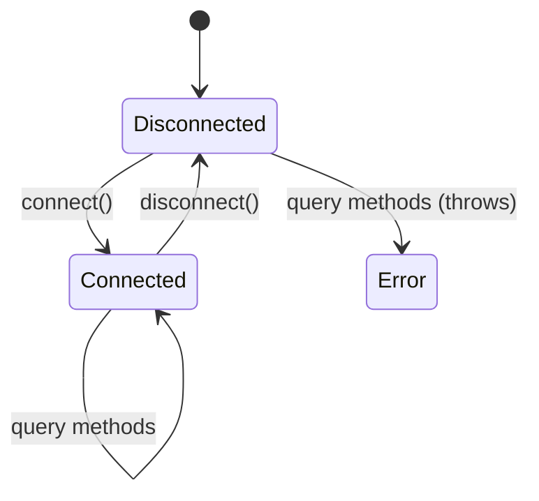

Created: 2026-03-14
Updated: 2026-03-14
Checked: -

# View-oriented Read-only Database Access

## Meta
| Source | Runtime |
|--------|---------|
| `code/app/daemon/src/database/database-reader.ts` | TypeScript (Node.js ESM) |

## Contract

```typescript
import { EventRow } from './types';

export class DatabaseReader {
  constructor(dbPath: string);
  connect(): Promise<void>;
  disconnect(): Promise<void>;
  getLatestEvents(limit?: number): Promise<EventRow[]>;
  getEventsByType(eventType: string, limit?: number): Promise<EventRow[]>;
  getUniqueFiles(limit?: number): Promise<EventRow[]>;
  getDirectoryEvents(directory: string, limit?: number): Promise<EventRow[]>;
  getEventCount(): Promise<number>;
}

// EventRow (from types.ts)
interface EventRow {
  id: number;
  timestamp: string | number;
  filename: string;
  directory: string;
  event_type: string;
  size: number;
  lines?: number;
  blocks?: number;
  inode: number;
  elapsed_ms: number;
}
```

### Public API

| Method | Input | Output | Description |
|--------|-------|--------|-------------|
| `connect` | - | `Promise<void>` | Open read-only SQLite connection |
| `disconnect` | - | `Promise<void>` | Close connection and release resources |
| `getLatestEvents` | `limit?` (default: 25) | `Promise<EventRow[]>` | Most recent events across all files |
| `getEventsByType` | `eventType`, `limit?` (default: 25) | `Promise<EventRow[]>` | Events filtered by type code |
| `getUniqueFiles` | `limit?` (default: 25) | `Promise<EventRow[]>` | Latest event per unique file |
| `getDirectoryEvents` | `directory`, `limit?` (default: 25) | `Promise<EventRow[]>` | Events filtered by directory (partial match) |
| `getEventCount` | - | `Promise<number>` | Total event count |

## State



- `db: sqlite3.Database | null` -- `null` when disconnected

### Connection Guard

All query methods check `this.db !== null` before execution. If `null`, the Promise is rejected with `"Database not connected"`.

## Logic

### Connection Mode

| Property | Value |
|----------|-------|
| Open mode | `OPEN_READONLY` |
| No PRAGMA configuration | Read-only; relies on daemon's WAL mode |

### Common Query Pattern

All event queries share the same SELECT shape:

| Column | Source | Default |
|--------|--------|---------|
| `id` | `events.id` | - |
| `timestamp` | `events.timestamp` | - |
| `filename` | `events.file_name` | - |
| `directory` | `events.directory` | - |
| `event_type` | `event_types.code` | - |
| `size` | `measurements.file_size` | `COALESCE(_, 0)` |
| `lines` | `measurements.line_count` | `COALESCE(_, 0)` |
| `blocks` | `measurements.block_count` | `COALESCE(_, 0)` |
| `inode` | `measurements.inode` | `COALESCE(_, 0)` |
| `elapsed_ms` | constant | `0` (placeholder) |

### Unique Files Query

Returns the latest event per file by selecting `MAX(id)` grouped by `file_id`. This provides a "current state" view of all tracked files.

### Directory Filter

Uses `LIKE '%directory%'` pattern matching -- partial/substring match, not prefix-only.

## Side Effects

- `connect()`: Opens a read-only file handle to the SQLite database
- `disconnect()`: Closes the file handle and sets `db` to `null`
- All query methods: Read-only; no database writes
