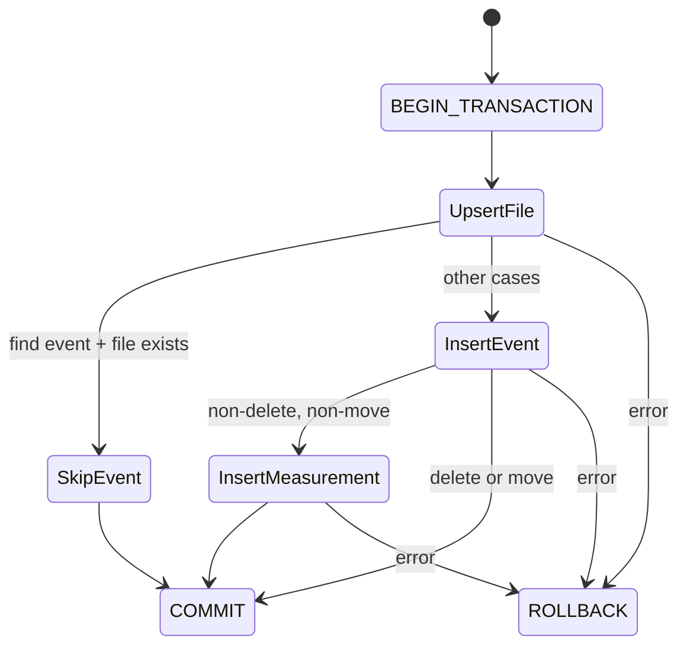

Created: 2026-03-14
Updated: 2026-03-14
Checked: -

# Supplement: Event Operations Transaction Logic

## Meta
| Source | Runtime |
|--------|---------|
| `code/daemon/src/database/EventOperations.ts` | TypeScript (Node.js ESM) |

**Supplements**: `database-schema-implementation.md` -- covers the transactional event insertion logic and file record management not detailed in the schema spec.

## Scope of Supplement

The schema spec defines table structures and a high-level `recordEvent` flow. This supplement specifies:
- Event type resolution via cached lookup
- File record upsert strategy (inode-based, not path-based)
- Find event deduplication (skip logic)
- Transaction boundary management
- Read query contracts (`getRecentEvents`, `getEventById`)

## Contract

```typescript
import { FileEvent, EventMeasurement } from './types';

export class EventOperations {
  constructor(db: sqlite3.Database);
  clearCache(): void;
  insertEvent(event: FileEvent, measurement?: EventMeasurement): Promise<number>;
  getRecentEvents(limit?: number, filePath?: string): Promise<FileEvent[]>;
  getEventById(eventId: number): Promise<FileEvent | null>;
}
```

### Public API

| Method | Input | Output | Description |
|--------|-------|--------|-------------|
| `clearCache` | - | `void` | Clear event type lookup cache |
| `insertEvent` | `FileEvent`, `EventMeasurement?` | `Promise<number>` | Record event in transaction, return event ID |
| `getRecentEvents` | `limit?` (100), `filePath?` | `Promise<FileEvent[]>` | Recent events, optionally filtered by path |
| `getEventById` | `eventId` | `Promise<FileEvent \| null>` | Single event lookup |

## State

- `eventTypeMap: Map<string, number> | null` -- Lazy-loaded cache mapping event type code to database ID. Loaded on first `insertEvent` call.

## Logic

### Event Type Resolution

Event type codes are resolved to IDs via a cached `Map<string, number>`. The cache is populated once from the `event_types` table. If the table is empty, an error is thrown (schema not initialized).

### Insert Transaction Flow



### File Upsert Decision Table

| File Exists (by inode)? | Event Type | Action |
|-------------------------|------------|--------|
| Yes | `find` | Skip event entirely (commit immediately) |
| Yes | `delete` | Set `is_active = 0`, continue to insert event |
| Yes | other | Set `is_active = 1`, continue to insert event |
| No | `delete` | Create file with `is_active = 0`, continue |
| No | other | Create file with `is_active = 1`, continue |

**Key difference from schema spec**: File lookup is by `inode`, not by `file_path`. This ensures correct tracking across renames.

### Measurement Insertion Decision

| Event Type | Measurement Inserted? |
|------------|----------------------|
| `delete` | No |
| `move` | No |
| All others | Yes (required) |

### Validation Rules

| Rule | Error |
|------|-------|
| delete/move without inode | `"inode is required for delete/move events"` |
| Any event without measurement.inode | `"Measurement with inode is required for database compliance"` |

### Timestamp Conversion

- Input: `Date` object (`event.timestamp`)
- Stored: Unix timestamp in seconds (`Math.floor(ms / 1000)`)
- Read back: Converted to `Date` via `new Date(seconds * 1000)`

## Side Effects

- `insertEvent`: Writes to `files`, `events`, and `measurements` tables within a single transaction
- `getRecentEvents`, `getEventById`: Read-only
