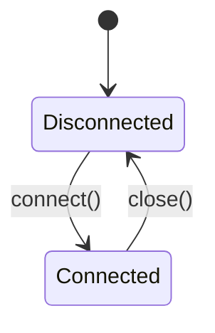

Created: 2026-03-14
Updated: 2026-03-14
Checked: -

# Supplement: Event Storage Connection Management

## Meta
| Source | Runtime |
|--------|---------|
| `code/app/daemon/src/database/EventStorageConnection.ts` | TypeScript (Node.js ESM) |

**Supplements**: `sqlite-database-foundation.md` -- covers connection lifecycle not specified in the foundation spec.

## Scope of Supplement

The foundation spec defines schema, indexes, seed data, and SQLite configuration (WAL mode, etc.). This supplement covers the **connection management layer** that wraps `sqlite3.Database` with lifecycle control.

## Contract

```typescript
export class EventStorageConnection {
  constructor(dbPath: string);
  connect(): Promise<sqlite3.Database>;
  close(): Promise<void>;
  getConnection(): sqlite3.Database | null;
  isConnected(): boolean;
}
```

### Public API

| Method | Input | Output | Description |
|--------|-------|--------|-------------|
| `connect` | - | `Promise<sqlite3.Database>` | Open DB, configure PRAGMAs, return handle |
| `close` | - | `Promise<void>` | Close DB and release handle |
| `getConnection` | - | `sqlite3.Database \| null` | Current connection (or null) |
| `isConnected` | - | `boolean` | Connection status check |

## State



- `db: sqlite3.Database | null` -- `null` when disconnected

## Logic

### Connection Initialization Sequence

| Step | Operation | Detail |
|------|-----------|--------|
| 1 | Directory check | Create `dbPath` parent directory if missing (`mkdirSync recursive`) |
| 2 | Open database | `OPEN_READWRITE \| OPEN_CREATE` mode |
| 3 | Enable WAL | `PRAGMA journal_mode=WAL` |
| 4 | Enable FK | `PRAGMA foreign_keys=ON` |

Steps 3-4 are executed in SQLite serialized mode (`db.serialize`) to guarantee ordering.

### Close Behavior

| Current State | Action |
|---------------|--------|
| Connected (`db !== null`) | Close handle, set `db = null` |
| Disconnected (`db === null`) | Resolve immediately (no-op) |

## Side Effects

- `connect()`: Creates directory on filesystem if not exists; opens file handle to SQLite database
- `close()`: Closes file handle
