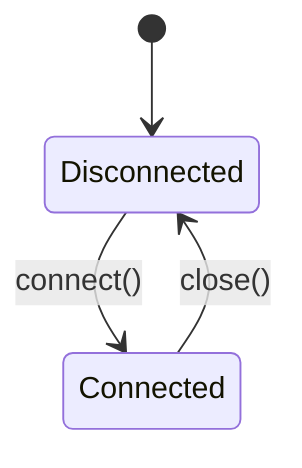

Created: 2026-03-14
Updated: 2026-03-14
Checked: -

# Supplement: FileEventRecorder Facade

## Meta
| Source | Runtime |
|--------|---------|
| `code/daemon/src/database/FileEventRecorder.ts` | TypeScript (Node.js ESM) |

**Supplements**: `database-schema-implementation.md` -- covers the coordinator/facade pattern that composes all database operation classes.

## Scope of Supplement

The schema spec describes table structures and a monolithic `DatabaseManager`. This supplement specifies the **modular facade** that replaced it:
- Composition of specialized operation classes
- Lifecycle management (connect/close initializes/destroys all sub-managers)
- Connection guard pattern on all delegated methods

## Contract

```typescript
export class FileEventRecorder {
  constructor(dbPath: string);

  // Lifecycle
  connect(): Promise<void>;
  close(): Promise<void>;
  isConnected(): boolean;
  getConnection(): sqlite3.Database | null;
  clearCache(): void;

  // Event Operations (delegated to EventOperations)
  insertEvent(event: FileEvent, measurement?: EventMeasurement): Promise<number>;
  getRecentEvents(limit?: number, filePath?: string): Promise<FileEvent[]>;

  // Aggregate Operations (delegated to AggregateOperations)
  getAggregateData(filePath?: string): Promise<any[]>;
  getGlobalStatistics(): Promise<any>;
  getFileStatistics(filePath: string): Promise<any>;
  getTopFilesByEvents(limit?: number): Promise<any[]>;

  // Measurement Operations (delegated to MeasurementOperations)
  insertMeasurement(eventId: number, measurement: MeasurementResult): Promise<void>;
  getMeasurementByEventId(eventId: number): Promise<MeasurementResult | null>;
  getMeasurementsByFilePath(filePath: string): Promise<MeasurementResult[]>;
  getMeasurementStatistics(): Promise<MeasurementStatistics>;
  getTopFilesByLines(limit?: number): Promise<FileMetric[]>;
  getTopFilesByBlocks(limit?: number): Promise<FileMetric[]>;

  // Trigger Management (delegated to TriggerManager)
  recreateTriggers(): Promise<void>;
}
```

## State



### Internal Components

| Component | Type | Initialized On |
|-----------|------|----------------|
| `connection` | `EventStorageConnection` | Constructor |
| `schemaManager` | `SchemaManager` | `connect()` |
| `triggerManager` | `TriggerManager` | `connect()` |
| `eventOps` | `EventOperations` | `connect()` |
| `aggregateOps` | `AggregateOperations` | `connect()` |
| `measurementOps` | `MeasurementOperations` | `connect()` |

All sub-managers are set to `null` on `close()`.

## Logic

### Connection Lifecycle

| Phase | Steps |
|-------|-------|
| `connect()` | 1. `EventStorageConnection.connect()` to get `sqlite3.Database` handle |
| | 2. Instantiate all operation classes with the handle |
| | 3. `SchemaManager.initializeSchema()` |
| | 4. `TriggerManager.createTriggers()` |
| `close()` | 1. `EventStorageConnection.close()` |
| | 2. Set all sub-managers to `null` |

### Connection Guard

Every delegated method checks that the corresponding operation class is non-null. If null, throws `"Database not connected"`.

### Delegation Pattern

FileEventRecorder contains no business logic. All methods are pure delegation to the appropriate operation class. This is the Facade pattern.

## Side Effects

- `connect()`: Opens database, creates schema if needed, creates triggers
- `close()`: Closes database connection
- All other methods: Delegated to sub-managers (see their respective specs)
