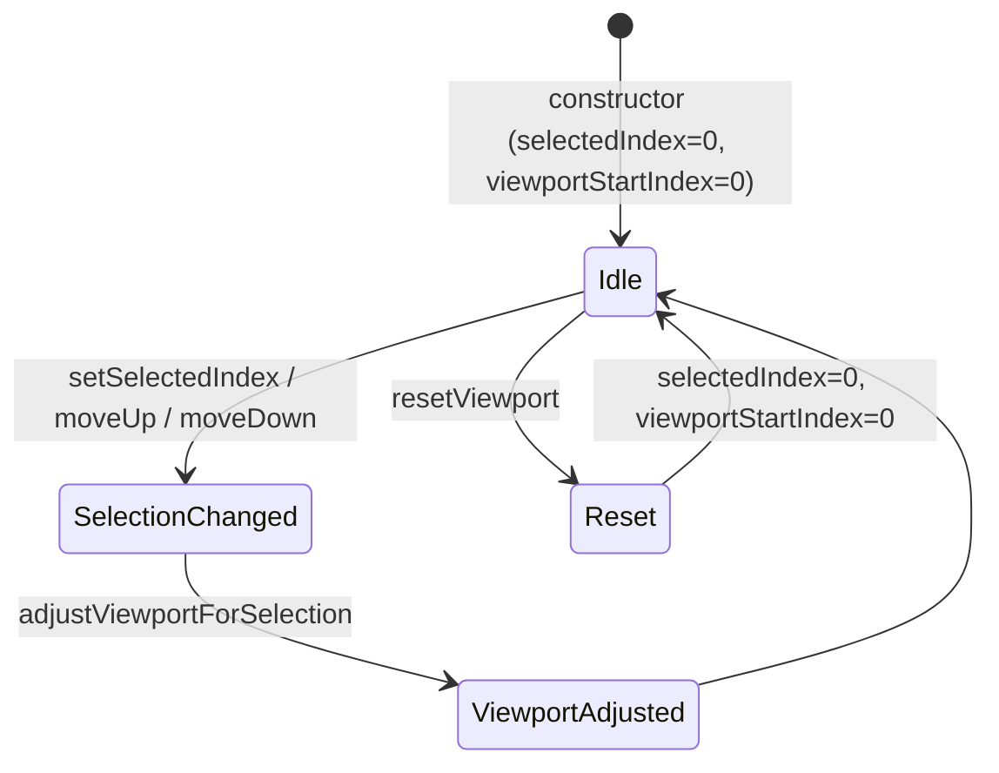

Created: 2026-03-14
Updated: 2026-03-14
Checked: -

# UI Viewport State

## Meta
| Source | Runtime |
|--------|---------|
| `code/app/view/src/ui/state/UIViewportState.ts` | TypeScript (Node.js ESM) |

## Contract

```typescript
class UIViewportState {
  getSelectedIndex(): number;
  setSelectedIndex(index: number, totalEvents: number): void;
  getViewportStartIndex(): number;
  getViewportHeight(): number;
  setViewportHeight(height: number): void;
  getVisibleSlice<T>(allEvents: T[]): T[];
  getRelativeSelectedIndex(): number;
  moveSelectionUp(totalEvents: number): void;
  moveSelectionDown(totalEvents: number): void;
  isTopRowVisible(): boolean;
  resetViewport(): void;
  getViewportInfo(): ViewportInfo;
}

interface ViewportInfo {
  selectedIndex: number;
  viewportStartIndex: number;
  viewportHeight: number;
  relativeSelectedIndex: number;
}
```

## State

Internal state: `selectedIndex`, `viewportStartIndex`, `viewportHeight` (default: 20).



## Logic

### Bounds Checking

`setSelectedIndex(index, total)`: clamps to `[0, total-1]`, then calls `adjustViewportForSelection`.

### Viewport Adjustment

| Condition | Action |
|-----------|--------|
| selectedIndex < viewportStartIndex | viewportStartIndex = selectedIndex |
| selectedIndex > viewportStartIndex + viewportHeight - 1 | viewportStartIndex = selectedIndex - viewportHeight + 1 |
| viewportStartIndex > max(0, total - viewportHeight) | clamp to maxViewportStart |

### getVisibleSlice

Returns `allEvents.slice(viewportStartIndex, viewportStartIndex + viewportHeight)`.

### isTopRowVisible

Returns `viewportStartIndex === 0`. Used by auto-refresh logic to skip refresh when user has scrolled down.

## Side Effects

None. Pure state management, no I/O.
