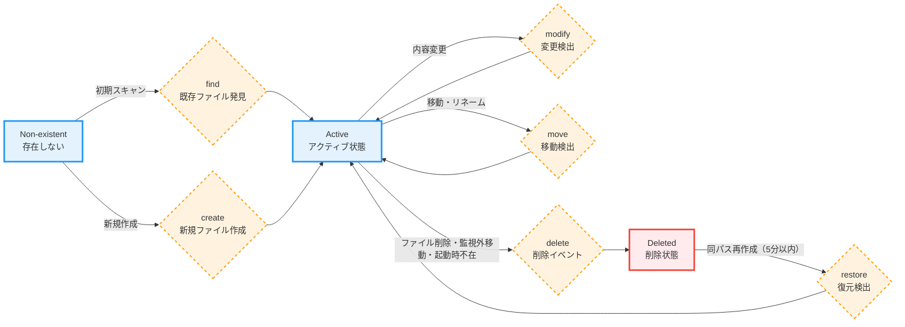
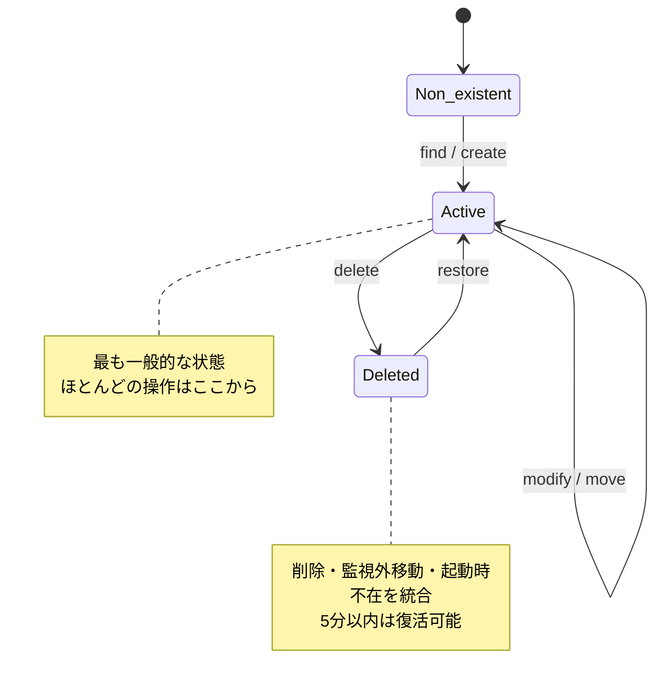

# ファイルライフサイクル状態遷移図

**作成日**: 2025年6月25日  
**作成者**: Architect Agent  
**関連**: FUNC-023（ファイルライフサイクル追跡機能）

## 完全なファイルライフサイクル状態遷移図



## イベント検出分岐ロジック

```mermaid
graph TD
    START[chokidar: add] --> READY{ready状態?}
    
    READY -->|ready前| FIND[find イベント]
    
    READY -->|ready後| ADD_CHECK{履歴確認}
    ADD_CHECK -->|deleted状態<br/>5分以内| RESTORE[restore イベント]
    ADD_CHECK -->|履歴なし| CREATE[create イベント]
    
    CHANGE[chokidar: change] --> MODIFY[modify イベント]
    
    UNLINK[chokidar: unlink] --> WAIT{100ms待機}
    WAIT -->|add検出<br/>同一inode| MOVE[move イベント]
    WAIT -->|タイムアウト| DELETE[delete イベント]
    
    STARTUP[起動時スキャン] --> DB_CHECK{DB active確認}
    DB_CHECK -->|FS不在| DELETE2[delete イベント<br/>(startup_missing)]
    
    style FIND fill:#e3f2fd
    style CREATE fill:#e3f2fd
    style MODIFY fill:#fff3e0
    style MOVE fill:#fff3e0
    style DELETE fill:#ffebee
    style DELETE2 fill:#ffebee
    style RESTORE fill:#f3e5f5
```

## 簡略版：状態中心の表記



## 状態とイベントの詳細説明

### 状態（States）

| 状態 | 説明 | 特徴 |
|------|------|------|
| **Non-existent** | ファイルが存在しない初期状態 | システムに未登録 |
| **Active** | 監視対象として活動中 | 最も一般的な状態 |
| **Deleted** | 削除・監視外移動・起動時不在 | 5分以内なら復元可能 |

### イベント（Events）

| イベント | 説明 | 遷移元 → 遷移先 |
|----------|------|------------------|
| **find** | 初期スキャンで既存ファイル発見 | Non-existent → Active |
| **create** | リアルタイムで新規ファイル作成 | Non-existent → Active |
| **modify** | ファイル内容・メタデータ変更 | Active → Active |
| **move** | ファイル移動・リネーム | Active → Active |
| **delete** | ファイル削除・監視外移動・起動時不在検出 | Active → Deleted |
| **restore** | 削除からの復活（5分以内） | Deleted → Active |

## 複雑なシナリオ例

### シナリオ1: 通常の開発フロー
```
Non-existent → [create] → Active → [modify] → Active → [modify] → Active → [delete] → Deleted
```

### シナリオ2: 削除と即座復元
```
Active → [delete] → Deleted → [restore (5分以内)] → Active → [modify] → Active
```

### シナリオ3: システム再起動と復旧
```
Active → [システム再起動] → Deleted (startup_missing) → [restore] → Active → [modify] → Active
```

### シナリオ4: 移動と削除の組み合わせ
```
Active → [move] → Active → [delete] → Deleted → [restore] → Active → [move] → Active
```

## 実装上の考慮事項

1. **状態の永続化**: 各状態はデータベースの`files.is_active`フィールドに保存（boolean）
2. **イベント記録**: すべての遷移は`events`テーブルに記録
3. **復活判定**: Delete→Restoreの判定ロジックが重要（5分以内の時間制限）
4. **パフォーマンス**: Active状態のファイルが大多数を占めるため、この状態の処理を最適化

## 状態遷移の制約

- **時間制限**: Deleted → Restoreは5分以内のみ（設定可）
- **同一性保持**: すべての遷移でobject_idは維持される
- **Deletedの保持**: 削除状態も履歴として保持（自動削除なし）
- **統合された削除**: ユーザー削除・監視外移動・起動時不在をすべてdeleteイベントで表現